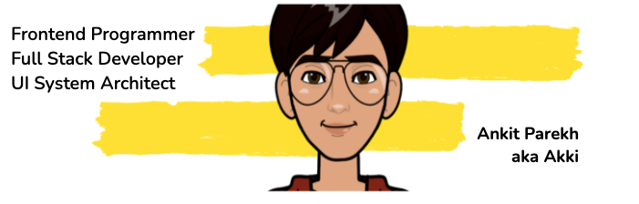

<!-- <h2 align='center'>Ankit Parekh @ Laxmena</h2>

<b>Frontend Programmer</b>
 -->

<h2>Hey! 👋</h2>

I'm Ankit Parekh
- <i>Currently:</i> working as Frontend Architect | Programmer. 
- <i>Previously:</i> Frontend Manager at Codifyd Inc.

<h2>💻 I'm Currently Developing and Working On Projects demanding knowledge of </h2>

- Angular
- Typescript | Javascript
- React
- React Native
- Node Js
- Sockets
- AWS
- Docker
- Jenkins
- Karma
- Jest
- Kubernetes
- MongoDB
- and many more... 

<h2> About Ankit⚡:</h2>

I'm a programmer living in Mumbai, IN. Outside Tech, I love to read, enjoy music and explore nature outdoors. If you are around Mumbai, drop an email and let's catch-up over Coffee!
 
 

### Languages and Tools:

 
 

---

- Check out my Resume: [https://akkiparekh.github.io/CV/)
- Write to me: [WriteTo@ankit77parekh@gmail.com](ankit77parekh@gmail.com)

<h2>📫 How to reach me:</h2>

 
      
